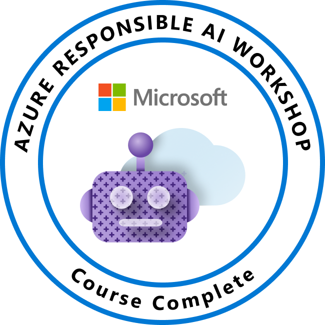

### 

<h1 align="center">Pascal Muthama</h1>

Full-Stack Software Developer • Backend Engineer • Data Enthusiast

I build modern, scalable, and user-focused web applications using Python and JavaScript. I enjoy turning ideas into reliable software, designing intuitive user experiences, and solving real-world problems through technology.

---

## Certifications

---

## About

- Full-Stack Software Developer with a passion for building modern web applications.
- Experienced in designing responsive frontend interfaces and scalable backend systems.
- Strong interest in Artificial Intelligence, Data Science, Cloud Computing and System Design.
- Always learning new technologies and building practical solutions.
- Open to Software Engineering, Full-Stack and Backend opportunities.

---

## Tech Stack

### Languages

### Frontend

### Backend

### Databases

### DevOps & Cloud

### Tools

---

## Featured Projects

| Project | Description | Technologies |
|----------|-------------|--------------|
| **OptiPesa** | Personal financial management system with analytics, budgeting and expense tracking. | Django, DRF, PostgreSQL |
| **Industrial Waste Management System** | QR-based truck validation and trip management system for EPZA. | Django, PostgreSQL |
| **Portfolio Website** | Personal portfolio showcasing projects, photography and software development. | React, Vite |
| **Cafe Management API** | RESTful backend for managing café operations. | FastAPI |
| **Expense Tracker API** | Personal finance REST API with authentication. | FastAPI |

---

## GitHub Analytics

---

## Current Focus

- Full-Stack Web Development
- Backend Engineering
- Frontend Engineering
- REST API Development
- Artificial Intelligence
- Data Science
- Cloud Computing
- System Design
- Open Source

---

## Daily Quote

---

